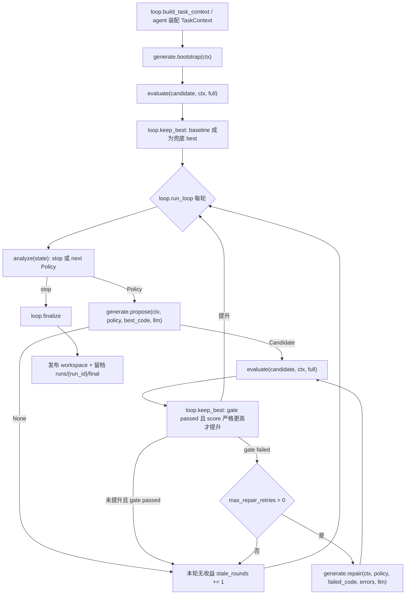

# 架构总览 — 推理框架自动调优 agent

本文记录当前代码里的业务分层和主流程。整个项目交付的不是一份手写 `engine.py`，而是一个在
阶段 A 自动生成、验证、优化、回退并发布 `engine.py` 的 agent。

## 1. 任务边界

评测分两个时间上完全分离的阶段：

- **阶段 A（本仓库）**：`run.sh -> python -m mls_infer_opt.loop`（入口即 `loop/__main__.py`）。
  agent 可以读取公开的 `model_config` 和 weights，在本地跑调优循环，最后落盘
  `workspace/engine.py`、`output3.*`、`report3.*`，并保证退出。
- **阶段 B（外部评测器）**：agent 已退出。评测器只 import `workspace/engine.py`，调用
  `create_engine / prefill / decode / remove`，先比 reference logits 的 correctness，再测
  prefill/decode/mixed 吞吐与显存。

推论：

- 所有 LLM、搜索、修复、报告逻辑都只能发生在阶段 A。
- `engine.py` 必须自包含，不能 import agent 包，不能依赖网络、LLM 或 `.env`。
- `engine.py` 不能硬编码模型结构，模型结构必须从 `create_engine(model_config, weight_dir, device)`
  的入参动态读取。

## 2. 训练类比

整个 agent 是一个小型训练循环：

```text
generate = train    产出一份 engine 候选
evaluate = eval     正确性 + 吞吐，给出反馈信号
analyze  = grad     根据反馈定位瓶颈，给搜索空间里的下一步方向
loop     = trainer  驱动循环、keep-best、判停、发布
```

四个业务模块按职责分，而不是按单个操作拆：

| 模块 | 训练类比 | 当前职责 |
|------|----------|----------|
| `loop/` | trainer | 建 `TaskContext`、驱动 bootstrap/每轮优化、keep-best、执行判停、finalize 发布与 artifacts。唯一发布出口。 |
| `generate/` | train | 产候选：`bootstrap` 保守 baseline、`propose` 按 `Policy` 生成优化候选、`repair` 按错误修复候选。 |
| `evaluate/` | eval | 权威 correctness gate + benchmark。只通过 gate 的候选才有 bench 和 score。 |
| `analyze/` | grad | 汇总 `LoopState` 态势，硬判停或给出下一步 `Policy`。LLM 可选，失败退回 rule-based。 |
| `llm/` | 基建 | generate/analyze 共用的 LLM 客户端与 fake/test double。不可用时暴露 `available=False` 或返回空。 |
| `state/` | 基建 | 共享数据契约：`TaskContext`、`LoopState`、`Candidate`、`Policy`、`GateResult`、`BenchResult`、事件流。 |

## 3. 一次运行的完整流程



实际入口在 `loop.trainer.run_loop(ctx, llm=None, hooks=None, config=None)`：

1. 建 `LoopState`，创建 run/output 目录，记录 `loop.init` 事件。
2. 调 `generate.bootstrap(ctx)` 产 baseline 候选。
3. 调 `evaluate(..., "full")` 做权威评测。
4. `keep_best` 只接受 `gate.passed` 且 score 严格更高的候选；baseline 通过后成为永久兜底。
5. 每轮先调 `analyze(state)`：
   - 若返回 `None`，loop 读取最近一条 analyze stop event 的 `stop_reason`，进入 finalize。
   - 若返回 `Policy`，loop 从当前 best 的候选目录读 `engine.py`，传给 `generate.propose`。
6. propose 成功后再次 full evaluate，再用 `keep_best` 决定是否提升。
7. 若候选没过 gate，loop 可按 `TaskContext.limits.max_repair_retries` 调 `generate.repair`，把
   结构化 `ValidationError` 回灌给 generate。
8. 未提升则 `stale_rounds += 1`；提升则 `stale_rounds = 0`。
9. finalize 发布当前 best 到 `ctx.engine_publish_path`，并写：
   - `output3.json`：轻量摘要。
   - `report3.json`：摘要 + `LoopState` 快照。
   - `results.log`：事件流文本。

同一批最终产物会双写：

```text
workspace/engine.py
workspace/output3.json
workspace/report3.json
workspace/results.log

runs/{run_id}/final/engine.py
runs/{run_id}/final/output3.json
runs/{run_id}/final/report3.json
runs/{run_id}/final/results.log
```

`workspace/` 是对外提交面；`runs/{run_id}/final/` 是本次 run 的审计快照，便于复盘最终发布物。

## 4. 数据如何流动

核心对象图如下：

```text
TaskContext
  ├─ model_config / device / paths / limits / environment
  └─ run_dir = runs/{run_id}

LoopState
  ├─ candidates: dict[candidate_id, Candidate]
  ├─ best_id / best_score / stale_rounds / budget
  └─ events: append-only AgentEvent[]

Candidate
  ├─ id / kind / round / parent_id / strategy_tags
  ├─ gate: GateResult | None
  └─ bench: BenchResult | None

Policy
  ├─ axes / knobs
  ├─ kind / round / parent_id
  └─ rationale: analyze 给 generate 的方向提示
```

候选源码和完整 policy 不常驻内存，落在候选目录：

```text
runs/{run_id}/candidates/{candidate_id}/engine.py
runs/{run_id}/candidates/{candidate_id}/policy.json
```

`Candidate.strategy_tags` 只是轻量摘要，供 analyze/report 快速看当前 best 应用了哪些非默认轴。
完整的 `Policy` 以 `policy.json` 为准。

## 5. 模块内部分层

### loop

- `build_task_context(...)`：轻量 INIT，按 Phase3 目录约定读取 `target/model_config.json`，构造
  `TaskContext`。更完整的环境探测由进程入口 `loop/__main__.py` 装配层补。
- `run_loop(...)`：可执行 trainer。通过 `LoopHooks` 注入 generate/analyze/evaluate，测试可用 fake。
- `keep_best(state, candidate)`：唯一选优逻辑。未过 gate 不参与；score 必须严格更高。
- `finalize(state, ...)`：唯一发布出口。只有当前 best 且 gate passed 才复制到
  `workspace/engine.py`，并同步留档到 `runs/{run_id}/final/engine.py`。

### analyze

- `situation.py`：从 `LoopState` 汇总 ephemeral `Situation`。
- `heuristic.py`：硬判停 + rule-based 贪心阶梯。
- `prompt.py`：构造 LLM 诊断 prompt，并把 LLM JSON 回复解析成 `Decision`。
- `grad.py`：主入口 `analyze(state, llm=None)`，返回下一个 `Policy` 或 `None`。

### generate

- `space.py`：搜索空间轴/选项/knobs 的唯一真相源。
- `policy.py`：`aggregate/merge`，把任意 axes/knobs 收敛成合法 `Policy`。
- `codegen.py`：`bootstrap/propose/repair`，生成候选并落盘。
- `compat.py`：消解非法策略组合。
- `prompt.py`：把 `Policy` 和错误反馈渲成生成 prompt。

当前 `codegen.py` 是“LLM 生成代码 + 静态检查 + quick gate 自检重试”的实现；后续如迁移到真正
tool-loop，loop 的外层契约不需要变：它仍只接收 `Candidate | None`，并只信外层 full evaluate。

### evaluate

- 父进程只做编排和收口，不 import torch。
- 子进程 worker 跑 gate/bench，坏候选只影响子进程。
- `evaluate(candidate, ctx, "full")` 是 loop 的权威反馈源。
- `quick_gate(...)` 只供 generate 内部自检，ephemeral，不进 `LoopState`。

## 6. 永久不变量

1. **未过 correctness 的候选绝不能发布**。发布只有 `loop.finalize` 一个出口。
2. **永远保留已验证 best**。新候选失败、LLM 失败、analyze 停止，都不能让最终产物退化或缺失。
3. **keep-best 必须严格更优**。通过 gate 只是入场资格，score 必须大于当前 `best_score` 才提升。
4. **deterministic 外层 + LLM 内层**。发布、选优、权威验证都在 loop/evaluate；LLM 只提出方向或代码。
5. **generate/analyze 无发布权**。它们只能产 `Candidate | None` 或 `Policy | None`。
6. **事件流 append-only**。模块结论进入 `LoopState.events`，report/output 从 state 派生。

## 7. 当前已实现与待接线

已实现：

- `analyze` 分层与测试。
- `generate` 搜索空间、policy 聚合、候选落盘、bootstrap/propose/repair。
- `evaluate` gate/bench 子进程隔离。
- `loop.trainer` 第一版可执行状态机、keep-best、repair 调度、finalize 发布、workspace/run-final
  artifact 双写。

仍待接线：

- `loop/__main__.py` 进程入口已实装：探测 environment/device、按 env 建 LLM client、调 `run_loop`，
  最外层 try/finally 保证 `exit 0` 且 `workspace/engine.py` 必在盘上（原始 baseline 兜底）。
  `limits`/更细的环境字段仍可继续补。
- report 可以从当前 `report3.json` 轻量快照继续扩展成人类可读版本。
