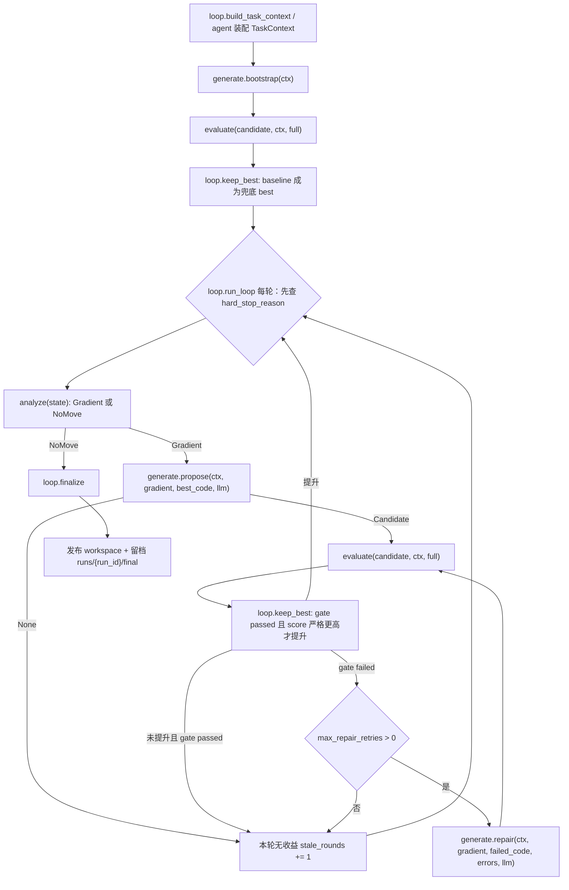

# 架构总览 — 推理框架自动调优 agent

本文记录当前代码里的业务分层和主流程。整个项目交付的不是一份手写 `engine.py`，而是一个在
阶段 A 自动生成、验证、优化、回退并发布 `engine.py` 的 agent。

## 1. 任务边界

评测分两个时间上完全分离的阶段：

- **阶段 A（本仓库）**：`run.sh -> python -m mls_infer_opt.loop`（入口即 `loop/__main__.py`）。
  agent 可以读取公开的 `model_config` 和 weights，在本地跑调优循环，最后落盘
  `workspace/engine.py`、`output3.*`（含逐轮 `rounds[]` 推理）+ `runs/{run_id}/report.json`
  （任务结果记录），并保证退出。
- **阶段 B（外部评测器）**：agent 已退出。评测器只 import `workspace/engine.py`，调用
  `create_engine / prefill / decode / remove`，先比 reference logits 的 correctness，再测
  prefill/decode/mixed 吞吐与显存。

推论：

- 所有 LLM、搜索、修复、报告逻辑都只能发生在阶段 A。
- `engine.py` 必须自包含，不能 import agent 包，不能依赖网络、LLM 或 `.env`。
- `engine.py` 不能硬编码模型结构，模型结构必须从 `create_engine(model_config, weight_dir, device)`
  的入参动态读取。

## 2. 训练类比

整个 agent 是一个小型训练循环：

```text
generate = train    产出一份 engine 候选
evaluate = eval     正确性 + 吞吐，给出反馈信号
analyze  = grad     根据反馈定位瓶颈，给搜索空间里的下一步方向
loop     = trainer  驱动循环、keep-best、判停、发布
```

四个业务模块按职责分，而不是按单个操作拆：

| 模块 | 训练类比 | 当前职责 |
|------|----------|----------|
| `loop/` | trainer | 建 `TaskContext`、驱动 bootstrap/每轮优化、keep-best、执行判停、finalize 发布与 artifacts。唯一发布出口。 |
| `generate/` | train | 产候选：`bootstrap` 保守 baseline、`propose` 按 `Gradient`（松建议）生成优化候选、`repair` 按错误修复候选。agent 在搜索维度界内自由探索，不被建议定点约束。 |
| `evaluate/` | eval | 权威 correctness gate + benchmark。只通过 gate 的候选才有 bench 和 score。 |
| `analyze/` | grad | 汇总 `LoopState` 态势，给出下一步 `Gradient` 或 `NoMove`（不判停）。LLM 是唯一方向源：不可用 → `NoMove("llm_unavailable")`；内容失败重试一次仍败 → `NoMove("llm_content_failure")`；C2 穿透。 |
| `llm/` | 基建 | generate/analyze 共用的 LLM 客户端与 fake/test double。不可用时暴露 `available=False` 或返回空。 |
| `searchspace/` | 基建 | 搜索维度唯一真相源（`space`）+ 围着它转的纯函数：`dims`（词表闸 / 标签 / 渲 prompt 菜单）、`compat`（轴间依赖规则 → prompt 文本）。analyze 与 generate 共用、互不横向 import。 |
| `state/` | 基建 | 共享数据契约：`TaskContext`、`LoopState`、`Candidate`、`Gradient`、`GateResult`、`BenchResult`、事件流。 |

## 3. 一次运行的完整流程



实际入口在 `loop.trainer.run_loop(ctx, llm=None, hooks=None, config=None)`：

1. 建 `LoopState`，创建 run/output 目录，记录 `loop.init` 事件。
2. 调 `generate.bootstrap(ctx)` 产 baseline 候选。
3. 调 `evaluate(..., "full")` 做权威评测。
4. `keep_best` 只接受 `gate.passed` 且 score 严格更高的候选；baseline 通过后成为永久兜底。
5. 每轮顶部先查 `hard_stop_reason(state)`（预算 / 轮数 / 连续无提升）；未触发则调 `analyze(state)`：
   - 若返回 `NoMove`，loop 把 `NoMove.reason` 写进 `stop_reason`，进入 finalize（停止由总控裁决，
     不走事件侧信道）。
   - 若返回 `Gradient`，loop 从当前 best 的候选目录读 `engine.py`，连同 gradient（松建议 +
     rationale）传给 `generate.propose`。
6. propose 成功后再次 full evaluate，再用 `keep_best` 决定是否提升。
7. 若候选没过 gate，loop 可按 `TaskContext.limits.max_repair_retries` 调 `generate.repair`，把
   结构化 `ValidationError` 回灌给 generate。
8. 未提升则 `stale_rounds += 1`；提升则 `stale_rounds = 0`。
9. finalize 发布当前 best 到 `ctx.engine_publish_path`，并写：
   - `output3.json`：摘要 + `result` 结果判定 + `rounds[]` 逐轮推理（诊断→策略→评测→结论）。对外发布。
   - `runs/{run_id}/report.json`：任务结果记录（内容同 output3.json）。`report3` 是人手写开发报告、运行时不产。
   - `results.log`：逐轮事件流文本，只留档 `runs/{run_id}/final`。

产物落点：

```text
workspace/engine.py            # 对外提交面：只交付 engine.py + output3.json
workspace/output3.json

runs/{run_id}/report.json          # 任务结果记录（运行结束产出，落 run 目录根）
runs/{run_id}/final/engine.py      # 审计快照：留档最终发布物
runs/{run_id}/final/output3.json
runs/{run_id}/final/results.log    # 逐轮事件日志（增量写、抗中途 kill）
```

`workspace/` 是对外提交面（engine.py + output3.*）；`runs/{run_id}/` 是本次 run 的独立目录——
`report.json` 在根作任务结果记录，`final/` 留档审计快照与 results.log 日志。`report3` 是人手写开发报告、非运行时产物。

## 4. 数据如何流动

核心对象图如下：

```text
TaskContext
  ├─ model_config / device / paths / limits / environment
  └─ run_dir = runs/{run_id}

LoopState
  ├─ candidates: dict[candidate_id, Candidate]
  ├─ best_id / best_score / stale_rounds / budget
  └─ events: append-only AgentEvent[]

Candidate
  ├─ id / kind / round / parent_id / strategy_tags
  ├─ gate: GateResult | None
  └─ bench: BenchResult | None

Gradient
  ├─ suggest_axes / knobs   # 相对 best 的松建议（已过词表闸 sanitize，不定点）
  ├─ kind / round / parent_id
  └─ bottleneck / rationale: analyze 给 generate 的瓶颈与方向提示
```

`Gradient` 刻意不是搜索空间里的恒合法定点：`suggest_axes` 只是优先方向，generate 的 agent 看完整
搜索维度自由探索，外层 full gate 才是唯一权威。候选源码与 agent 自述的实际采用落在候选目录：

```text
runs/{run_id}/candidates/{candidate_id}/engine.py
runs/{run_id}/candidates/{candidate_id}/applied.json   # agent 回报的实际 axes/knobs + 本轮 rationale，留档审计
```

`Candidate.strategy_tags` 是轻量摘要，**取自 agent 过门时如实回报的 `applied_axes`**（过 `sanitize_axes`
词表闸 + 去默认），不再来自 analyze 下发的定点——这是 honest tags 的咽喉点（见 [[agentic-generate]]）。
agent 没回报 / 走回退文本路径则空 tags（诚实「未报」）。不再写 `policy.json`（已无恒合法定点）。

## 5. 模块内部分层

### loop

- `build_task_context(...)`：轻量 INIT，按 Phase3 目录约定读取 `target/model_config.json`，构造
  `TaskContext`。更完整的环境探测由进程入口 `loop/__main__.py` 装配层补。
- `run_loop(...)`：可执行 trainer。通过 `LoopHooks` 注入 generate/analyze/evaluate，测试可用 fake。
- `keep_best(state, candidate)`：唯一选优逻辑。未过 gate 不参与；score 必须严格更高。
- `finalize(state, ...)`：唯一发布出口。只有当前 best 且 gate passed 才复制到
  `workspace/engine.py`，并同步留档到 `runs/{run_id}/final/engine.py`。

### searchspace

搜索维度的共享层，analyze 与 generate 都依赖、互不横向 import。

- `space.py`：搜索维度（轴/选项/knobs/组件/敏感度）的唯一真相源。
- `dims.py`：围着 `space` 转的纯函数——`sanitize_axes`（词表闸，过滤到已知轴+合法选项、不填默认）、
  `strategy_tags` / `grouped_axes`（标签与分组）、`render_search_dims`（渲成 prompt 菜单）。不定点、不落盘、零 torch。
- `compat.py`：轴间依赖规则——`CONSTRAINTS`/`Requires` + `render_constraints`（渲成 prompt 规则文本）。
  非法组合由外层 full gate 拦下，此处不再自动降级消解（`resolve`/`validate`/`Violation` 已删）。

### analyze

- `situation.py`：从 `LoopState` 汇总 ephemeral `Situation`；`best_axes` 由 best 的 honest `strategy_tags` 还原。
- `prompt.py`：构造 LLM 诊断 prompt（注入搜索维度菜单 + 依赖规则 + best + 历史 + 预算），`parse_gradient`
  把 LLM JSON 回复解析成 `Gradient`（`suggest_axes` 过词表闸）或 `NoMove`。单次调用 + 确定性解析，不走 tool-loop。
- `grad.py`：主入口 `analyze(state, llm=None)`，返回下一个 `Gradient` 或 `NoMove`。LLM 是唯一方向源（不可用/内容失败 → `NoMove`，C2 穿透）。

### generate

- `codegen.py`：`bootstrap/propose/repair`，生成候选并落盘。`bootstrap` 产不依赖 LLM 的 baseline；
  `propose`/`repair` 按 `Gradient` 驱动 LLM。过门时连 agent 回报的 `applied_axes/applied_knobs` 一起 capture，
  `strategy_tags` 取自该回报（honest）、并写 `applied.json` 留档。
- `prompt.py`：把 `Gradient`（松建议 + rationale）和错误反馈渲成生成 prompt，注入完整搜索维度 + 依赖规则。

当前 `codegen.py` 把 `check_engine` 自检工具交给模型边写边自检（`run_agent` tool-loop）；loop 的外层
契约不依赖其内部形态：它仍只接收 `Candidate | None`，并只信外层 full evaluate（见 [[agentic-generate]]）。

### evaluate

- 父进程只做编排和收口，不 import torch。
- 子进程 worker 跑 gate/bench，坏候选只影响子进程。
- `evaluate(candidate, ctx, "full")` 是 loop 的权威反馈源。
- `quick_gate(...)` 只供 generate 内部自检，ephemeral，不进 `LoopState`。

## 6. 永久不变量

1. **未过 correctness 的候选绝不能发布**。发布只有 `loop.finalize` 一个出口。
2. **永远保留已验证 best**。新候选失败、LLM 失败、analyze 停止，都不能让最终产物退化或缺失。
3. **keep-best 必须严格更优**。通过 gate 只是入场资格，score 必须大于当前 `best_score` 才提升。
4. **deterministic 外层 + LLM 内层**。发布、选优、权威验证都在 loop/evaluate；LLM 只提出方向或代码。
5. **generate/analyze 无发布权**。它们只能产 `Candidate | None` 或 `Gradient | NoMove`。
6. **事件流 append-only**。模块结论进入 `LoopState.events`，report/output 从 state 派生。

## 7. 当前已实现与待接线

已实现：

- `analyze` 分层与测试。
- `searchspace` 搜索维度真相源 + 词表闸/标签/菜单（`dims`）+ 依赖规则（`compat`），analyze/generate 共用。
- `generate` 候选落盘、bootstrap/propose/repair；`strategy_tags` 取自 agent honest 回报。
- `evaluate` gate/bench 子进程隔离。
- `loop.trainer` 第一版可执行状态机、keep-best、repair 调度、finalize 发布、artifact 落盘
  （workspace 对外交付 engine.py+output3.json；runs/{run_id} 留档审计快照、results.log、report.json）。
- `generate` agent 工具自检自闭环：把 `check_engine` 工具交给模型边写边自检（run_agent tool-loop），
  外层 full gate 仍是唯一权威。

仍待接线：

- `loop/__main__.py` 进程入口已实装：探测 environment/device、按 env 建 LLM client、调 `run_loop`，
  最外层 try/finally 保证 `exit 0` 且 `workspace/engine.py` 必在盘上（原始 baseline 兜底）。
  `limits`/更细的环境字段仍可继续补。
- 逐轮推理已机读化进 `output3.json` 的 `rounds[]`；人类可读的开发报告 `report3.*` 由人手写，运行时不产。
