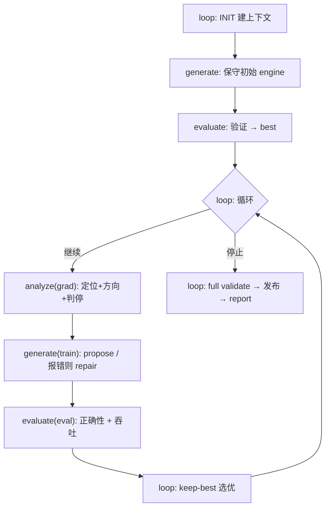

# 架构总览 — 推理框架自动调优 agent

> Phase 1 产物：按业务逻辑切分模块、描述任务。**具体状态/接口签名后续逐步确定**，本文件只锁定
> 职责边界与不变量。

## 1. 任务本质（来自 MIGRATION.md / PHASE3 指南）

我们交付的不是手写的 `engine.py`，而是一个**会自动生成 / 验证 / 优化 / 回退 / 报告 `engine.py`
的 agent**。`engine.py` 只是 agent 的产物。

评测分两个**时间上完全分离**的阶段：

- **阶段 A（本仓库）**：`run.sh → agent.py`。agent 读公开 config/weights，跑调优循环，落盘
  `workspace/engine.py`（自包含纯 PyTorch）、`output3.*`、`report3.*`，然后 `exit 0`。
- **阶段 B（评测器）**：agent 已退出。评测器 `import workspace/engine.py`，调
  `create_engine / prefill / decode / remove`，先对 reference logits 比正确性
  （`allclose(atol=1e-2, rtol=1e-2)`），再用 prefill/decode/mixed trace 测吞吐与显存。

推论：所有 LLM/工具/优化逻辑都在阶段 A；`engine.py` 不能 import agent 包、不依赖网络/LLM/`.env`；
engine 不得硬编码模型结构，全部从传入的 `model_config` 动态构建。

## 2. 业务结构 —— 一次「训练」

整个 agent 就是一个**训练循环**：不断 train → eval → grad，直到收敛或预算耗尽。

```text
generate = train    产出一份 engine 候选
evaluate = eval     正确性 + 吞吐，给出反馈信号
analyze  = grad     定位问题，给搜索空间里的下一步方向
loop     = trainer  驱动三者循环 + 选优(keep-best) + 发布
```



只有 4 个业务模块 + 2 个基建模块，**按业务逻辑分，不按单个操作分**：

| 模块 | 训练类比 | 职责 |
|------|----------|------|
| `loop/` | trainer 循环 | INIT 建上下文、驱动循环、keep-best 选优、判停执行、finalize 发布 + report。**唯一发布出口**。 |
| `generate/` | train | 产 engine 候选：bootstrap(保守初始) / propose(按方向) / repair(按报错)，本质同一件事 |
| `evaluate/` | eval | 正确性(allclose gate) + 吞吐/显存 benchmark → 反馈信号；唯一可靠反馈源 |
| `analyze/` | grad | 汇总反馈、定位瓶颈、给下一步策略+runtime_knobs、判停 |
| `llm/` | 基建 | LLM 客户端：多 provider、tool loop、不可用即回退不抛异常（generate/analyze 共用） |
| `state/` | 基建 | 共享数据契约：TaskContext/Candidate/EvalResult/OptimizationPlan/LoopState/events |

> 之前一版按「每个流程状态一个模块」拆了 14 个（context/gate/repair/measure/selection/report/
> skills/* …），过度碎片化。现按业务收敛：correctness+benchmark 都是「评测」→ evaluate；
> baseline+propose+repair 都是「产 engine」→ generate；INIT/keep-best/report 都是 trainer
> 职责 → loop。

## 3. 永久不变量（任何重构都不能破坏）

1. 未过 correctness 的候选，**绝不能**成为最终 `workspace/engine.py`。发布只有一个出口
   （loop finalize），候选先落临时区，过正确性才发布。
2. 永远保留 fallback / keep-best：任何时刻有一个「当前已知可用」engine 兜底；新候选只在严格
   更优且已验证时取代它。generate/analyze 失败/超时/产垃圾，只是「这轮没收益」，绝不让产物
   退化或缺失。
3. `agent.py` 始终 `exit 0`，失败信息进 `results.log` / `output3.json`，不靠崩溃表达。
4. agent ↔ engine 只通过稳定数据结构交换；读取方只依赖已声明字段，写入方可加字段不改语义。
5. **deterministic 外层 + LLM 内层**：发布/选优/验证这些必须可控的步骤在 loop/evaluate
   （决定性）；LLM 只在 generate/analyze 里「提出」候选与方向，没有任何直接发布权。

## 4. 待定项（Phase 2+ 再锁定）

- 各模块函数签名与 state 字段（先参考 specs/00_shared_contracts.md，按需收敛）。
- generate 内部 bootstrap/propose/repair 的拆分粒度（文件 vs 函数）。
- evaluate 与外部 evaluator 脚本的复用方式（直接 import vs 子进程隔离）。
- 候选修改粒度（整文件替换 vs 骨架+策略点填充）；候选工作目录布局。
